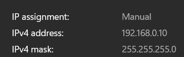

# Communication

The communication network of the system uses a websocket server over a local wifi network delivered by 2 TP-link CPE-710. The Access point is denoted by the `AP` on  and the client is denoted by `C`.

## TP-Links 

The TP-Link CPE-710 is a 5GHz 300Mbps 23dBi Outdoor CPE. It is used to create a local wifi network for the server and client to communicate. The CPE-710 is a point to point device, meaning it can only connect to one other device. The `AP` is configured to connect to the other `C` and create a local wifi network.

|     | Access Point | Client | 
| --- | --- |--- |
| IP Address: | `192.168.0.254` | `192.168.0.254` |
| SSID: | `rocketry` | `rocketryClient` |
| Password: | `rocketsrock` | `rocketsrock` |

### Setup 

Either of the CPE-710s can act as the `AP` or `C`. The `AP` must be connected to the Valve cart Mini PC and run this code base as the server. To access the `AP` connect the LAN side of the POE adapter then change you're ethernet IPv4 settings to the following:

This will allow you to connect to the `AP`. You can now configure/monitor the wifi system by going to the `AP`'s IP address in a web browser. 

**PharOS**

A guide for the PharOS can be found [here](/Docs/PharOS(UN)_V1_UG.pdf)

The PharOS is the web interface for the TP-Link CPE-710. It is used to configure the device. The default login is `admin` and the password is `admin`. however, these values have been changed to the credentials above.

### Access Point Network setup

The access point is configure in AP router mode. This enables a local network to be created by the `AP`, the ports that are open are:

- 80 (for http)
- 443 (for https)
- 22 (for ssh)

### Client Network setup

