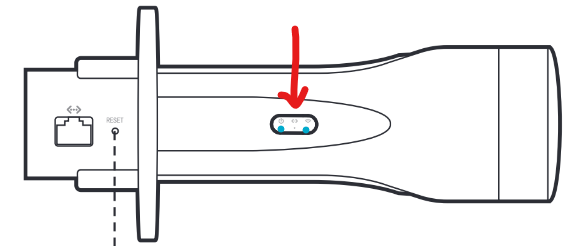

# Communication

The communication network of the system uses a websocket server over a local wifi network delivered by 2 TP-link CPE-710. The Access point is denoted by the `AP` on  and the client is denoted by `C`.

## TP-Links 

The TP-Link CPE-710 is a 5GHz 300Mbps 23dBi Outdoor CPE. It is used to create a local wifi network for the server and client to communicate. The CPE-710 is a point to point device, meaning it can only connect to one other device. The `AP` is configured to connect to the other `C` and create a local wifi network.

|     | Access Point | Client | 
| --- | --- |--- |
| IP Address: | `192.168.0.254` | `192.168.0.253` |
| SSID: | `rocketry` | `rocketryClient` |
| Password: | `rocketsrock` | `rocketsrock` |

In the current configuration the `AP` is connected to the Mission control and hosts the local network named `UVR-PDP`. The `C` is connected to the Valve cart Mini PC and connects directly to `AP` and shares the `UVR-PDP` network. 

### Network Setup 

Either of the CPE-710s can act as the `AP` or `C`. The `AP` must be connected to the Valve cart Mini PC and run this code base as the server. To access the `AP` connect the LAN side of the POE adapter then change you're ethernet IPv4 settings to the following:


This will allow you to connect to the `AP`. You can now configure/monitor the wifi system by going to the `AP`'s IP address in a web browser. 

**PharOS**

A guide for the PharOS can be found [here](/Docs/PharOS(UN)_V1_UG.pdf)

The PharOS is the web interface for the TP-Link CPE-710. It is used to configure the device. The default login is `admin` and the password is `admin`. however, these values have been changed to the credentials above.

Fom our investigation it seems that PharOS cannot be connected too when the device is in AP mode and connected to a windows machine through LAN on the POE adapter. The only way to connect to the device is through the wifi network.

### Access Point Network setup

The access point is configure in AP router mode. This enables a local network to be created by the `AP`, the ports that are open are:

- 80 (for http)
- 443 (for https)
- 22 (for ssh)

### Client Network setup

## Basic Setup 

Make sure the `C` is connected to the mini PC through the POE adapter at the valve cart. The `AP` should be power, you will see two LED light up on the device.



Once the you see two LEDs, connect to the `UVR-PDP` network. The `C` should automatically connect to the `AP` and share the `UVR-PDP` network.

### SSH credentials

First connect to the `UVR-PDP` network. Then ssh into the mini PC using the following credentials:

```bash
$ ssh uvr@192.168.0.1
uvr@192.168.0.1's password:
$ rockets
```

If connection is successful you should see the following:

```bash
Welcome to Ubuntu 22.04.4 LTS (GNU/Linux 6.5.0-26-generic x86_64)
```


